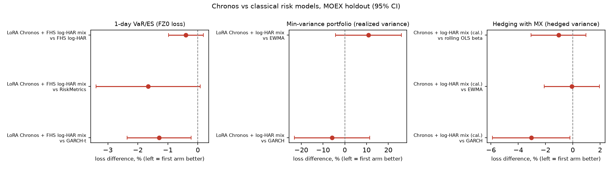

# Findings: Chronos-2 on MOEX equities

**Headline result: a rigorous, replicated null.** Across ~10 independent axes (universe composition, time
resolution (daily / 1h / 10m), grouping (multivariate vs. univariate attention), price adjustment (raw vs.
dividend/split-adjusted), context length (35 / 100 / 250 bars), sector homogeneity, and cross-ticker lead-lag
structure), zero-shot Chronos-2 shows no directional edge on MOEX equity returns beyond chance. Every gate,
pre-registered before its run, failed. For a study like this the methodology *is* the contribution: the question
is whether the process would have caught a real edge if one had been there.

Two follow-ups extend the question beyond direction. A cross-sectional study found real ranking skill
(IC ≈ 0.07) but no net alpha beyond standard factors. A risk study found that Chronos reaches, but does
not beat, the best classical models for VaR/ES and hedging on a pre-registered 2025–26 holdout (both
sections below).

## Why this is a meaningful negative result, not just "it didn't work"

A negative result is only informative if the test had teeth:
- **Pre-registered gates.** ΔDA (directional accuracy) > 0 AND at least one Benjamini-Hochberg-significant cell
  favoring the tested arm AND that arm beating naive baselines, fixed before each run.
- **Multiple-comparisons correction** on every family that tests more than one (ticker, horizon) cell.
- **Discovery/confirmation splits** with verified non-overlapping dates for every hypothesis-generating step:
  candidates are never evaluated on the data used to find them.
- **Traps caught, not just a clean pipeline.** A spurious market-factor pattern in the lead-lag screen was found
  and fixed before confirmation, and the one BH-significant ticker the context sweep produced (UNAC) was sent to
  a fresh holdout and explained rather than reported (both below).

## Method

**Model.** [Chronos-2](https://arxiv.org/abs/2510.15821) (`amazon/chronos-2`), used strictly zero-shot. It
alternates *time attention* (within one series) and *group attention* (across the series in a batch), so one
ticker's recent path can inform another's forecast without retraining (`cross_learning=True`). Every prediction
is a quantile forecast (q10/q50/q90 used here).

**Why this model.** Published benchmarks (fev-bench, GIFT-Eval, Chronos Benchmark II) show Chronos-2 strongest on
covariate-informed and multivariate tasks, the capability tested here. They are general forecasting benchmarks,
though, and returns are close to a martingale by construction. The gap between "good at forecasting in general"
and "good at forecasting returns" is why this project exists rather than trusting the benchmark numbers.

**Why the bar is ~0.536 DA, not 0.5.** A directional bet with round-trip cost `c` and move size `m` has positive
expected value only when the hit rate `p > 0.5 + c/(2m)`. With `c ≈ 0.10%` and `m ≈ 1.4%`, `p* ≈ 0.536`. So the
chance-level DA seen throughout (≈0.49–0.51) is a clean failure, not a near-miss.

**Evaluation.** Walk-forward: for each config, up to 400 non-overlapping-anchor windows, each a real forecast
scored against realized returns at the configured horizons. Per (ticker, horizon) cell: DA with binomial p-value
and Wilson interval, Pearson/Spearman correlation, quantile coverage. Baselines (zero, last, momentum-5, AR(1))
use the identical windows. All multi-cell families are BH-corrected.

| Family | Question | Test |
|---|---|---|
| Basket gate | Does joint (multivariate) attention across a basket beat forecasting each ticker independently? | Paired McNemar test, window by window, on configs differing only in `group_mode` |
| Lead-lag confirmation | Does any pair in a wide ticker universe show real lead-lag structure? | Lagged cross-correlation screen → BH-corrected shortlist → re-test on a strictly later, non-overlapping window |
| Sector basket | Does a single homogeneous sector (vs. the cross-sector basket) change the multivariate-vs-univariate answer? | Same McNemar gate, per sector |

## A methodological trap, caught in real time

The first lead-lag discovery screen (unresidualized correlations) found 20 BH-significant pairs, but 19 of them
shared the same lag (3 bars) across unrelated tickers (oil/gas with retail, metals with transport). That is the
signature of a shared factor, not pairwise structure: the equal-weight market return had lag-3 autocorrelation
≈0.16 on that window. Leave-one-out market-factor residualization before the lagged correlations kept only 2 of
the 20 original pairs and spread the significant lags across 1–5. The discovery/confirmation design caught it
before it reached confirmation.

## Results

**Basket gate: multivariate vs. univariate (paired McNemar, BH-corrected)**

| Config | n windows | Cells (ticker×horizon) | BH-significant | Aggregate ΔDA | Gate |
|---|---:|---:|---:|---:|---|
| Daily, ctx=250 | 400 | 64 | 0 | −0.0011 | FAIL |
| Daily, ctx=100 | 400 | 64 | 0 | −0.0005 | FAIL |
| Daily, ctx=35 | 400 | 64 | 0 | −0.0001 | FAIL |
| 1h, ctx=250 | 400 | 64 | 0 | +0.0003 | FAIL |
| 1h, ctx=100 | 400 | 64 | 0 | +0.0018 | FAIL |
| 1h, ctx=35 | 400 | 64 | 0 | +0.0014 | FAIL |
| 10-minute, ~2mo window (2023) | 400 | 64 | 0 | −0.0010 | FAIL |
| 10-minute, ~2mo window (2024) | 400 | 64 | 0 | +0.0010 | FAIL |

Eight runs across three resolutions and three context lengths: |ΔDA| ≤ 0.0018 and 0 of 64 cells BH-significant
in every run. The two arms track each other almost window by window.

**Lead-lag confirmation (discovery → confirmation, close_adj)**
- Discovery (2020-02-21 → 2023-06-30, 55-ticker panel, market-factor residualized): 14,850 (pair, lag,
  direction) tests, 20 BH-significant (q < 0.05, capped at the top 20 by |r|).
- Confirmation (2023-07-01 → 2024-12-30, strictly out-of-sample): each pair re-tested, with its own BH correction
  within the 20-pair family.
- **Result: 0/20 pairs replicate.** The best uncorrected p (AFLT→UNAC, lag 1, p = 0.058) gives p_bh = 0.70.
  Several correlations shrink or flip out-of-sample (e.g. AFLT→PHOR, lag 2: r = −0.217 → −0.066).
- Basket-wide Chronos-2 on the same 18-ticker shortlist: mean DA 0.49–0.50 at ctx 35, 100 and 250, and 0/72
  cells BH-significant at ctx=35 and ctx=250. The same pattern held at daily, 1h and on raw close.

**UNAC at ctx=100: a second false positive, explained.** The ctx=100 run was the one exception: UNAC was
BH-significant at all four horizons (DA 0.60–0.64, p_bh as low as 0.0002) and beat every baseline (all ≤ 0.56),
which clears every leg of the per-pair gate. The same ticker and window were null at the other context lengths:

| context_len | n windows | UNAC DA (h1) | p (BH-corrected) |
|---|---:|---:|---:|
| 35 | 350 | 0.523 | 0.9998 |
| 100 | 285 | 0.635 | 0.0002 |
| 250 | 135 | 0.585 | 0.5210 |

The effect was stable within the window (DA 0.59–0.66 in every half and quarter of the 285 windows), so it was
tested on data nobody had looked at: the same 18-ticker family at ctx=100 on 2024-11-01 → 2026-09-17 (385
windows, from a dedicated `data_pipeline` pull; config
[`leadlag_confirm_adj_ctx100_holdout2025.yaml`](forecasting/configs/leadlag_confirm_adj_ctx100_holdout2025.yaml)).
**UNAC's DA fell to 0.545–0.569**: still the top 4 of 72 cells, but no horizon survives BH (best p_bh = 0.26), and
no other ticker does either. Two checks close it:
- **Base rate.** The best holdout cell's raw p ≈ 0.008 (h=2, DA 0.569) is not rare in a family of 72:
  under a global null, `1 − (1 − 0.008)^72 ≈ 44%`.
- **Mechanism.** UNAC's lag-1 return autocorrelation was 0.222 in the confirmation window, vs 0.054 in discovery
  and 0.068 in the holdout: a +157% spike in August 2023 (0.77 → 1.99), then a decline in nearly every month
  through May 2024 (−7%, −13%, −31%, +18%, −10%, −5%, −15%, −33%…). A zero-information rule, "yesterday's sign
  predicts the 2-day-ahead sign", gets DA 0.535 on the confirmation window and 0.478 on the holdout: the same rise
  and fall as Chronos (0.60 → 0.55). Chronos was partly riding a transient momentum regime in one ticker's own
  history, not a lead-lag dependency, which is what this test was built to detect.

As with the market-factor bug, a result that clears every pre-registered gate can still be explained by
something unrelated to the hypothesis; a fresh holdout plus a mechanism check is what tells the difference.

**Sector baskets** (oil & gas, metals & mining, financials, utilities × {daily, 1h} × {ctx 35, 100, 250} = 24
configs, same McNemar gate)

| Sector | Resolution/ctx | BH-sig cells | Gate |
|---|---|---:|---|
| Oil & gas | 1h, ctx=250 | 1/48 (ΔDA negative) | FAIL |
| all other 23 combinations | — | 0/N | FAIL |

A homogeneous sector changes nothing: one BH-significant cell across 24 × ~40 tested, with negative aggregate ΔDA,
so the multi-part gate correctly rejects it as the lone chance hit a family this size produces.

**Resolution and context length.** The null holds at daily, hourly and 10-minute resolution and at 35 (≈7 weeks),
100 (≈20 weeks) and 250 bars (≈1 year). No choice recovered a signal another missed; the one exception (UNAC) is
explained above.

## Two additional checks on the pooled run data

**Is the model more accurate when it predicts larger moves?** Primary-horizon predictions from all eight
basket-gate runs (153,600 forecasts), binned by predicted move size:

| Bin (by \|predicted return\|) | n | DA |
|---|---:|---:|
| Q1 (smallest) | 30,720 | 0.451 |
| Q2 | 30,720 | 0.477 |
| Q3 | 30,720 | 0.486 |
| Q4 | 30,720 | 0.493 |
| Q5 (largest) | 30,720 | 0.488 |

DA rises with predicted size through Q4, dips at Q5, and never reaches 0.5: not a usable filter.

**Is there short-horizon structure Chronos could be missing?** On the 10-minute panel (16 tickers, ~69,000 bars)
the mean lag-1 return autocorrelation is −0.007 (range −0.085 to +0.098) and consecutive bars share a sign 46.8%
of the time, close to the 50% no-relationship baseline. There is no meaningful mean reversion or momentum at 10 minutes for Chronos to have missed.

## What this doesn't rule out

From the project's design document ([`docs/transient_dependency_research.md`](docs/transient_dependency_research.md)):
none of these experiments rule out dependencies that exist only in short bursts, intraday delays that dissipate
by the close, event- or regime-conditioned or nonlinear relationships, dependencies in volatility, volume or
order flow rather than returns, lead/lag structure that changes across regimes, or anything outside the tickers,
dates and fields tested. An event-conditioned burst-detection follow-on (dependencies appearing briefly around
large moves), run at daily and hourly resolution under three parameter settings, was null as well.

## Cross-sectional follow-up: Chronos-2 quantiles as alpha and as a risk model

The directional-accuracy null above asks whether Chronos-2 can call each ticker's direction. A portfolio manager asks something different: do its **quantile forecasts**, turned into cross-sectional signals, earn net alpha beyond standard factors, or make a better volatility model? This follow-up tested that question in [`forecasting/alpha_experiment/`](forecasting/alpha_experiment/README.md).

**Setup.**
- **Data:** a daily panel on the **main-session close** (18:40 closing auction). 47–70 point-in-time-eligible liquid names.
- **Forecasts:** 21-quantile forecasts at every trading day.
- **Books:** weekly-rebalanced, beta-neutral long-short and long-only books, with 5 bps costs plus borrow.
- **Tests:** Fama-MacBeth and net spanning regressions against momentum / reversal / low-vol / AR(1) books. For volatility, QLIKE against intraday realized variance.
- **Protocol:** a pre-registered one-shot 2024 test, then an improvement wave on 2021–2024 with a trial ledger (238 rows). The 2025–26 holdout was reserved for the risk study.

**Result: the per-ticker null does not carry over to ranking, but the ranking skill is not tradable.**
- **Real cross-sectional IC.** Chronos ranks stocks with IC 0.07–0.08 (t 6–7). In 2024 its IC (0.088–0.096) was higher than any classic signal's.
- **Mostly known factors.** A linear "mimic" on cheap trailing statistics reproduces about 45% of the signal, and it *trades better* than Chronos: net Sharpe 2.0 vs 1.2.
- **No net alpha.** The pre-registered 2024 net spanning-alpha leg failed (t −0.55; −0.97 on corrected data).
- **Nothing tried changed that.** The 20-configuration sweep covered cross-learning (4 grouping schemes), past covariates (index, sector, futures), context 64–512, and residual / weekly / log-price targets. Its best net spanning t was 0.82 (cov_fut).
- **Improvements on top of the winner didn't either.** Quantile-shape signals, combination with classic factors and turnover control were built afterwards. The best, an EMA-smoothed cov_fut signal, reached spanning t 1.46, still below 2. The winning configuration stays below 2 even at zero cost (t 1.71).
- **The best configuration.** Covariates with Brent, USD/RUB and gold futures keep a Chronos-specific component beyond a mimic given the same inputs (Fama-MacBeth t 2.47, an upper bound since the mimic is linear). But:
  - that component's own book loses money (net Sharpe −0.38);
  - its weight in a combination with classic factors is about 0.002;
  - a Bonferroni bound across the 20 configurations would need t ≈ 3.

**Volatility: a good off-the-shelf model, matched by log-HAR.**
- **Return-based width:** Chronos's forecast width from daily returns is no better than EWMA or GARCH(1,1), and its tails were too narrow in 2024 (6.7% q05 hits).
- **Realized-variance target:** run on log realized variance, Chronos beats EWMA, GARCH and HAR (QLIKE 0.50 vs 0.65–0.85).
- **But log-HAR matches it:** a pooled log-HAR with a market term reaches QLIKE 0.455 (DM t +0.78). Chronos's edge came from working in log space and pooling across names, not from anything a classical model cannot do.
- **Distinct information, little practical gain:** a pre-registered encompassing test shows Chronos carries information log-HAR lacks (t 4.3), mostly in calm years. A fixed combination does not lower QLIKE, and no portfolio use showed an economic gain.

**Next:** whether Chronos is useful for **risk** (VaR/ES, vol targeting, minimum-variance portfolios, hedging). See the risk follow-up below.

## Risk follow-up: Chronos-2 for VaR, vol targeting, minimum-variance portfolios and hedging

The alpha follow-up found Chronos-2 a good volatility model that log-HAR matches. The last open question was
whether that makes it useful for **risk decisions**, and whether calibration, mixing with classical models,
multivariate input, covariates or LoRA fine-tuning give it an edge. This study, in
[`forecasting/risk_experiment/`](forecasting/risk_experiment/README.md), used the sealed 2025–26 holdout.

**Setup.**
- **Uses:** 1-day VaR/ES at 5% for every stock (FZ0 loss); vol targeting an equal-weight book to 10%
  (Fleming-Kirby-Ostdiek performance fee); a long-only minimum-variance portfolio (realized 5-day variance);
  hedging each stock with the IMOEX future (hedged 5-day variance).
- **Arms:** zero-shot Chronos on returns, log realized variance and both jointly; calibrated and FHS versions;
  fixed, fitted and regime-dependent mixtures with the best classical model; a one-factor covariance model;
  market/macro covariates; and LoRA fine-tuning on Colab with yearly refits trained only on past data.
  Classical rivals: RiskMetrics/EWMA, GARCH(-t), FHS, HAR and log-HAR variants, rolling OLS beta.
- **Protocol:** all selection on 2021–24 (265 trials in the ledger), then a pre-registration committed before
  any holdout forecast existed, then one evaluation on 2025-01 → 2026-09 (395–433 forecast dates per use).
  - Family A, "better than": beat EWMA/RiskMetrics **and** GARCH (L1), then the best classical model (L2), plus a
    calm-day VaR claim (R); Holm-corrected across uses.
  - Family B, "not worse": non-inferiority against the best classical model, with margins fixed on dev.

**Result: parity with the best classical risk models, no demonstrated advantage.**

| Confirmatory claim (holdout) | Statistic | Raw p | After Holm |
|---|---|---|---|
| Not worse, VaR/ES (margin 0.063 FZ0) | mean(C − B) −0.012, upper 95% bound +0.003 | 8e-17 | ✅ pass |
| Not worse, hedging (margin +0.5 pp vol) | upper 95% bound 1.3e-5 vs margin 6.6e-5 | 8e-6 | ✅ pass |
| L1 VaR/ES: beats RiskMetrics and GARCH-t | t −1.87 / −2.37 | 0.031 | ❌ (needs ≤ 0.010) |
| R: VaR beats FHS log-HAR on calm days | t −1.31 (381 days) | 0.095 | ❌ |
| L1 vol targeting / GMV / hedging | see the table below | 0.71 / 0.92 / 0.48 | ❌ |

| Use (holdout) | Chronos arm | Best classical | Baselines |
|---|---|---|---|
| VaR/ES, FZ0 (lower is better) | **−3.082** (LoRA Chronos + FHS log-HAR mix) | FHS log-HAR −3.070 | GARCH-t −3.043, RiskMetrics −3.032 |
| 5% VaR hit rate (Kupiec p) | 4.77% (0.056) | 4.98% (0.90) | RiskMetrics 5.35% (0.004), GARCH-t 5.65% (1e-7) |
| Vol targeting, fee of Chronos (bps/yr) | one-factor Chronos | −128 vs log-HAR on portfolio RV | +243 vs EWMA, −72 vs GARCH |
| Minimum-variance portfolio, annual vol | 17.74% (LoRA Chronos + log-HAR mix) | **EWMA 16.85%** | GARCH 18.29% |
| Hedging, hedged annual vol | **31.13%** (Chronos + log-HAR mix, calibrated) | rolling OLS beta 31.30% | EWMA 31.14%, GARCH 31.62% |

- **Not worse, confirmed:** for VaR/ES and hedging, Chronos (mixed with a classical model) is not meaningfully
  worse than the best classical model, and has the best point estimate in both (not significant: t −1.34 and
  −1.01).
- **Not better:** no "better than" claim survives the Holm correction.
- **Where it loses:** plain EWMA stays best for minimum-variance portfolios, and GARCH and a log-HAR portfolio
  model beat the Chronos vol-targeting book.

**The dev period over-stated Chronos, and the holdout caught it.**
- **Calm-day VaR:** Chronos beat FHS log-HAR on calm days with dev t −4.0; the pre-registered holdout claim gave
  t −1.3 (p 0.095). A winner's curse from picking the best of 265 variants.
- **Fine-tuning:** multivariate LoRA fine-tuning (returns and log-RV jointly) beat zero-shot Chronos in 21 of 22
  arms on 2022–24. On the holdout the VaR gain reversed sign (t +1.07) and the GMV gain was insignificant.
  Fine-tuning on log-RV alone never helped.
- **Regimes:** "better in calm, worse in stress" held on dev; on the holdout it reversed for GMV.

**Engineering lessons worth keeping.**
- An evaluation that requires every arm to exist on a date silently dropped the 2022 crash months, because the
  regime mixtures had no values there. It was found by a dry run of the holdout code and fixed before the
  holdout opened (all dev tables re-scored, trials not re-counted).
- A median-based calibration of single-series forecasts is biased for χ²-like ratios (vol-targeted books ran at
  18–20% instead of 10%); it uses a rolling mean now.
- Fine-tuned forecasts start only in 2022, so they were spliced onto their zero-shot twins before 2022; otherwise
  every calibrated or mixed arm would have been undefined during the crash.

**Bottom line across the three studies:** Chronos-2 has no directional edge, no tradable alpha, and for risk it
reaches, but does not beat, the best classical tools, at a much higher compute cost (a GPU for fine-tuning and a
transformer forward pass per forecast date, against closed-form or small-regression classical models).

## Fine-tuning (parallel track, paused)

An early attempt to fine-tune Chronos-2 for directional accuracy through AutoGluon was paused (an unresolved
intraday index-alignment bug, and no dedicated held-out design) and is not in this repository. Fine-tuning was
later done properly for the risk follow-up: LoRA, yearly refits trained only on past data, its own holdout.

## Data caveats for the results above

Audits in the follow-up found issues that also touch the inputs of the experiments reported earlier in this document. Their recorded results were **not recomputed**.
- **The daily close is the evening print.** The `candles_1d` close is the evening-session last print (~23:40 MSK), not the main-session close. It matches the main close on only 0.2–1.2% of days in 2021, 2023 and 2024, and on about half the days in 2020 and 2022. The daily-resolution experiments above used it.
  - This is not a leak: all series are consistently timed.
  - It does mean the "close" in those tests is an evening-session print, not the main-session close a daily strategy would realistically trade at.
  - The follow-up uses the main-session close from 10-minute bars.
- **Dividend adjustment was one trading day late before 2023-07-31.** The poptimizer `day` field is the record date, not the ex-date. Under T+2 settlement this left a spurious −div / +div pair around every pre-T+1 dividend: for yields above 2% the mean was −5.0% then +6.8%, and the worst case was GAZP 2022-10 at −20.7% then +36.8%. Also fixed:
  - five dividends missing from the source were added;
  - one unpaid dividend (MGNT 2025-01) was removed;
  - record dates after the data end are no longer applied.

  Every `close_adj`-based result above (e.g. the lead-lag confirmation on `close_adj`) was computed on the uncorrected series.
- **Holiday rows.** The earlier pipeline puts each series on a regular grid with forward-fill (`to_regular_series` / `build_price_panel` in `forecasting/lib.ipynb`), so market holidays on that grid become zero-return rows. The follow-up uses an exchange-derived calendar with no forward-fill. The effect on the earlier directional-accuracy results was not measured.

## Limitations and future work

- **Scope.** All experiments use MOEX equities, 2020–2024 daily/2023–2024 intraday, a fixed
  universe selected by liquidity. Results do not generalize to other markets, periods, or
  ticker sets by assumption.
- **Detection vs. profitability.** This project tests for statistical dependency, not
  whether a deployable strategy exists. A basket-wide null does not by itself rule out a
  narrow, regime-specific edge too small for these test families to detect at the sample
  sizes used.
- **Calibration/volatility use and fine-tuning** were the open direction here, and have since been
  tested: see *Cross-sectional follow-up* (Chronos on realized variance is strong but matched by log-HAR)
  and *Risk follow-up* (calibrated, mixed and LoRA fine-tuned Chronos reaches, but does not beat, the best
  classical risk models on a pre-registered holdout).

## Engineering notes

The data pipeline ([`data_pipeline/`](data_pipeline/)) that feeds this project is a
self-contained sibling project: it pulls MOEX AlgoPack candle, order-flow, and
open-interest data into a reproducible, tested Parquet output, including a dividend/split
price-adjustment step added mid-project after a data-quality check found no prior result
had ever adjusted for corporate actions (verified via a direct scan of known dividend/split
events; the adjustment is additive — a new `close_adj` column alongside the untouched raw
`close`, so no earlier committed result changed). Its notebook is generated from tracked
Python source via a build script (never hand-edited), with an offline test suite (fake ISS
responses, no network access needed) run after every change.
