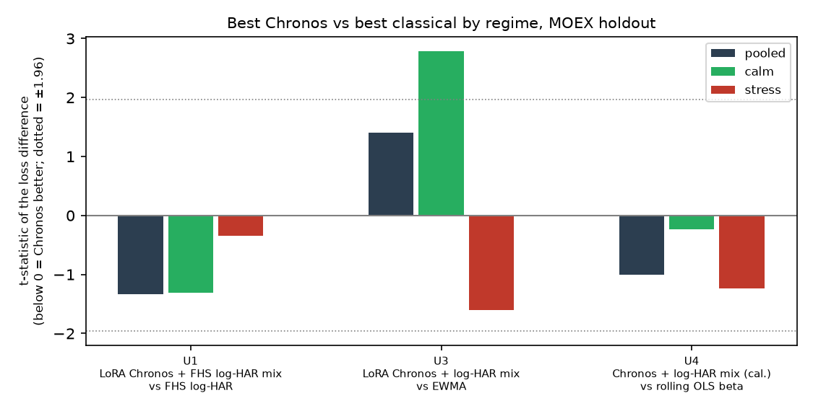

# Chronos-2 as a risk model: pre-registration and results

**Question.** Is Chronos-2 useful for **risk** on MOEX equities, where the alpha experiment
([`../alpha_experiment/`](../alpha_experiment/README.md)) found no tradable return alpha? Chronos is tested
zero-shot, calibrated, mixed with classical models, with multivariate [return, log-RV] input, with
market/macro covariates, and LoRA fine-tuned. If it is useful, is that in calm regimes, stress regimes, or
both, and what exactly helps?

**Uses:**

| Use | Task | Primary loss |
|---|---|---|
| U1 | 1-day VaR/ES at 5%, every stock | FZ0 (a strictly consistent score for the VaR/ES pair) |
| U2 | Vol targeting an equal-weight book to 10% | Fleming-Kirby-Ostdiek performance fee vs EWMA |
| U3 | Long-only minimum-variance portfolio (GMV), weekly | Realized 5-day portfolio variance |
| U4 | Hedging each stock with the IMOEX future (MX) | Squared hedged 5-day return |

**Periods:** dev 2021-01 → 2024-12 (all selection happens here); holdout 2025-01 → 2026-09-17, sealed and
opened once after the pre-registration below is committed.

## Dev results (2021–2024)

Every variant evaluated on dev is in [`trial_ledger.csv`](trial_ledger.csv) (265 trials). Tables are in
[`results/dev/`](results/dev/); figures in [`../../docs/figures/`](../../docs/figures/).

| Use | Best Chronos arm | Best classical arm | Chronos vs best classical |
|---|---|---|---|
| U1 VaR/ES | LoRA-Chronos + FHS log-HAR mix | FHS log-HAR | better, not significant (t −0.56); significantly better than RiskMetrics and GARCH-t |
| U2 vol targeting | Chronos one-factor model | log-HAR on portfolio RV | +14 bps/yr (p 0.44) |
| U3 GMV | LoRA-Chronos + log-HAR mix | EWMA | worse (21.4% vs 20.8% ann. vol on 2022–24), not significant |
| U4 hedging | Chronos + log-HAR mix (calibrated) | rolling OLS beta | worse (t +1.57) |

What the dev period shows:
- **Parity, not superiority.** In every use the best Chronos arm is within noise of the best classical model.
  Only weak baselines (RiskMetrics, GARCH-t, GARCH) are beaten significantly.
- **Regimes.** Chronos arms tend to be better on calm days and worse in stress (the 2022 crash), most clearly
  for VaR: the U1 Chronos mix beats FHS log-HAR on calm days (dev t −4.0) and loses on stress days (t +1.0).
- **What helps.** Mixing Chronos with a classical model beats Chronos alone in every use. Multivariate
  LoRA fine-tuning (F2: returns and log-RV together) improves on zero-shot Chronos consistently in U1, U2 and
  U3 (21 of 22 F2 arms in those uses better than their zero-shot twin on 2022–24). Fine-tuning on log-RV alone
  (F1), past covariates (N6), and a Chronos model of the correlation side (N5) add nothing measurable.
- **Cost.** Chronos arms need a transformer forward pass per forecast date and a GPU for fine-tuning; the
  classical arms are closed-form or small regressions.

**Disclosed corrections made on dev (before the holdout):**
1. **FZ0 domain.** FZ0 is only defined where ES < VaR < 0. It is scored only on cells where every arm is
   valid (9 zero-shot cells, and later 1 fine-tuned cell: TATNP 2024-11-11, a positive 5% VaR).
2. **Evaluation universe (plan H).** The regime mixtures are undefined from 2021-11 to 2022-03, and requiring
   every arm to exist had silently dropped those months, the 2022 crash, from every use. They no longer gate
   the universe; all dev tables were re-scored without new trials and the frozen arms re-selected. The
   pre-fix tables are kept in [`results/dev_old_universe/`](results/dev_old_universe/).
3. **Calibration bias.** Single-series calibration first used a median ratio, which is biased for χ²-like
   ratios (vol-targeted books ran at 18–20% instead of 10%); it now uses a rolling mean.

<!-- PREREG_START -->
## Pre-registration (committed before any holdout forecast exists)

### 1. Holdout data
- 2025-01-02 → 2026-09-17: 434 trading days, 429 forecast dates with a realized 5-day window.
- 69–78 eligible stocks per day, from the same panel construction as dev.
- 52 stress days by the real-time rule fixed on dev ([`results/regime_rule.json`](results/regime_rule.json):
  5-day mean of IMOEX log realized variance above its trailing 91st percentile), 382 calm days.
- Data QA was done on market data only ([`results/holdout_qa.json`](results/holdout_qa.json)).

### 2. Frozen arms
Selected on dev by the pooled primary loss after the plan-H correction; the fine-tuning rule below then
replaced C in U1 and U3.

| Use | Chronos arm (C) | Best classical arm (B) | Reference arms |
|---|---|---|---|
| U1 | `mixeq_chr_F2ret`: 50/50 Vincentized mix of LoRA-Chronos F2 return quantiles and FHS log-HAR | `fhs_loghar` | RiskMetrics (`rm`), GARCH-t |
| U2 | `fac_chr`: one-factor covariance, Chronos market and residual variances | `port_loghar` | EWMA, GARCH |
| U3 | `mixeq_chr_F2rv`: geometric 50/50 mix of LoRA-Chronos F2 5-day variance and pooled log-HAR | `ewma` | EWMA, GARCH |
| U4 | `mixeq_chr_Z3_cal`: zero-shot Chronos log-RV + pooled log-HAR mix, calibrated | `ols_beta` (rolling 250-day) | EWMA, GARCH |

- **Fine-tuning rule** (fixed before the fine-tuned results were seen): an F arm replaces C only if its pooled
  primary loss is lower than C's on the common 2022–24 dates (no fine-tuned forecasts exist for 2021).
  Result: F2 arms replaced C in U1 (FZ0 −3.0320 vs −3.0158, t −2.34) and U3 (21.42% vs 21.48%, t −0.22).
  This selection is in-sample on 2022–24; the holdout is the test.
- **Fine-tuning protocol:** LoRA (r 8) on Chronos-2, yearly refits trained only on data up to Dec 31 of the
  previous year, learning rate chosen on the last 60 pre-cutoff days. Holdout folds: 2025 (trained ≤ 2024)
  and 2026 (trained ≤ 2025), same code ([`colab/ft_core.py`](colab/ft_core.py)).
- **Dry-run validation:** [`holdout_run.py`](holdout_run.py) `dryrun` rebuilds every frozen arm identically to
  the dev evaluation (0.0 difference, cell by cell) and evaluates dev with the holdout code
  ([`results/dev/dryrun_frozen_arms.json`](results/dev/dryrun_frozen_arms.json)).

### 3. Confirmatory claims
One-sided tests, Newey-West lag 8, α = 0.05, Holm correction within each family.

**Family A, "better than"** (fixed sequence L1 → L2 within each use)
- **L1:** C beats **both** reference arms (intersection-union test: DM p < 0.05 against each).
  U2 uses the FKO fee bootstrap instead of DM.
- **L2**, tested only if L1 passes after Holm: C beats B.
- **Claim R** (joins family A's first step): *U1: C beats B on calm days*, a DM test on the calm-day loss
  differences. Dev: t −4.0; expected holdout t ≈ −2.7 at the dev effect (power ≈ 86%, lower if selection
  inflated the dev effect).

**Family B, "not worse"** (non-inferiority): C is not worse than B if the one-sided 95% upper bound of
mean(L_C − L_B) is below δ. Margins fixed from dev ([`results/dev/prereg_power.csv`](results/dev/prereg_power.csv)):

| Use | δ | Meaning | Power if truly equal / at the dev gap |
|---|---|---|---|
| U1 | 0.0630 FZ0 | C keeps at least half of B's dev improvement over RiskMetrics | 68% / 80% |
| U4 | +0.5 pp annual hedged vol (variance units at B's level) | a practically negligible hedging loss | 81% / 38% |
| U3, U2 | none | not testable: holdout standard errors are too large (U3 power 9% at +0.5 pp; U2 s.e. ≈ 268 bps/yr) | — |

**Stress (secondary):** Giacomini-White test with instruments (1, stress), calm and stress reported
separately. A stress-specific statement is made only if the use's pooled claim passes.

### 4. Reported but not claimed
Calibrated vs raw; mixture vs components; fine-tuned vs zero-shot twin; N1 vs Z1/Z2; N4 vs daily; N5 and N6
vs Z3; Kupiec, Christoffersen, Acerbi-Szekely and Basel for U1; per-year and ex-Feb–Apr-2022 descriptives;
U2 fees with bootstrap CIs.

### 5. Procedure
1. Commit this block.
2. Generate holdout forecasts only for the sources the frozen arms need: zero-shot Z3 (U4) and N5 (U2)
   locally; LoRA F2 (U1, U3) in Colab from the holdout bundle. Classical arms are computed on the full panel
   with the same causal code. Fine-tuned forecasts must cover every eligible stock-day exactly once before
   any scoring.
3. Evaluate **once** with the code in this commit. The evaluator refuses a second run. If a bug is found
   after opening, both the original and the corrected numbers are reported.
4. Write the results below `PREREG_END`.

### 6. Known limitations (stated before opening)
- **Survivorship:** the universe is based on current liquidity.
- **Short holdout:** "not significant" in family A is the expected outcome for most uses.
- **One market:** there is no replication on another exchange.
- **Selection:** 265 dev trials; the frozen arms are dev winners, so dev effects are optimistic.
- **Realized-variance bias** for co-movement (Epps effect in 10-minute data); factor arms are calibrated for it.
- **No 2021 fine-tuning fold:** no series had enough history before its training cutoff.
- **Pretraining overlap:** it is unknown whether MOEX series were in Chronos-2's pretraining data.
<!-- PREREG_END -->

## Holdout results (opened once, 2026-09-25)

Evaluated once with the code committed at `7b93e90`; the confirmatory code is unchanged since the
pre-registration commit `e0f0c45`. Raw output: [`results/holdout/results.json`](results/holdout/results.json).

**Verdict: parity with the best classical risk models, no demonstrated advantage.** The two "not worse" claims
pass by a wide margin; no "better than" claim survives the Holm correction, including the calm-day claim.

### Confirmatory claims

| Claim | Holdout statistic | Raw p | After Holm |
|---|---|---|---|
| **Not worse, U1** VaR/ES (δ 0.0630 FZ0) | mean(C − B) −0.012, upper 95% bound +0.003 | 8e-17 | ✅ pass |
| **Not worse, U4** hedging (δ +0.5 pp vol) | mean(C − B) −2.0e-5, upper bound 1.3e-5 (δ 6.6e-5) | 8e-6 | ✅ pass |
| L1 U1: beats RiskMetrics and GARCH-t | t −1.87 / −2.37 | 0.031 | ❌ (needs ≤ 0.010) |
| R: U1 beats FHS log-HAR on calm days | t −1.31 (381 calm days) | 0.095 | ❌ |
| L1 U2: beats EWMA and GARCH (fee) | +243 bps (p 0.03) / −72 bps (p 0.71) | 0.713 | ❌ |
| L1 U3: beats EWMA and GARCH | t +1.40 / −0.67 | 0.920 | ❌ |
| L1 U4: beats EWMA and GARCH | t −0.06 / −2.10 | 0.477 | ❌ |
| L2 (any use) | not tested: no L1 passed | — | — |

### Losses per use

| Use | Chronos arm (C) | Best classical (B) | References |
|---|---|---|---|
| U1 FZ0 (lower is better) | **−3.0819** | −3.0697 (C − B: t −1.34) | GARCH-t −3.0426, RiskMetrics −3.0317 |
| U1 5% VaR hit rate (Kupiec p) | 4.77% (0.056) | 4.98% (0.90) | RiskMetrics 5.35% (0.004), GARCH-t 5.65% (1e-7) |
| U2 fee of C vs each arm (bps/yr) | — | −128 vs log-HAR on portfolio RV | +243 vs EWMA, −72 vs GARCH |
| U3 GMV annual vol | 17.74% | **EWMA 16.85%** | GARCH 18.29% |
| U4 hedged annual vol | **31.13%** | OLS beta 31.30% (C − B: t −1.01) | EWMA 31.14%, GARCH 31.62% |

### Regimes (secondary: no pooled claim passed, so nothing is claimed)

- **U1:** Chronos is ahead of FHS log-HAR on calm days (t −1.31) and on stress days (t −0.35); both are
  insignificant. The dev calm-day effect (t −4.0) shrank to a third, which is the expected winner's curse of
  picking the best of 265 dev variants.
- **U3:** the dev pattern reversed. Chronos is worse than EWMA on calm days (t +2.79) and better on stress
  days (t −1.60; Giacomini-White p 0.012).
- **U4:** no regime difference (GW p 0.54).
- "Chronos is better in calm markets" does not hold as a general rule.

### Reported, not claimed
- **Fine-tuned vs zero-shot (F2 vs N1, [`results/holdout/twins_report.csv`](results/holdout/twins_report.csv)):**
  the dev gain did not replicate for VaR (mix t +1.07, raw +0.34: F2 slightly worse). For GMV it keeps the dev
  direction but is insignificant (mix t −0.57, raw −0.63). Fine-tuning shows no demonstrated gain.
- **VaR coverage** ([`results/holdout/coverage_report.csv`](results/holdout/coverage_report.csv)): the table
  above; Christoffersen independence rejected for 15% of names for C and 12% for B.
- **Not produced:** the other items listed under "Reported but not claimed" (calibrated vs raw, mixture vs
  components, N1 vs Z1/Z2, N4 vs daily, N5/N6 vs Z3, per-year descriptives, U2 fee CIs). Procedure step 2
  limited the holdout sources to those of the frozen arms, so their inputs were never generated; the two
  sections of the pre-registration conflicted, and step 2 was followed.

### Notes and deviations
- **Start date:** the pre-registration says the holdout starts 2025-01-02; the first trading day in the
  panel is 2025-01-03. The day count (434) is correct.
- **Dates per use:** U1 uses 433 forecast dates (1-day horizon), U2/U3 429 (5-day horizon), U4 395 (windows
  containing an MX futures roll are dropped for all arms).
- **Extra source (plan J):** zero-shot N1 holdout forecasts were generated after the pre-registration for the
  F2-vs-zero-shot report only; the twin and coverage reports are separate, report-only code (additions only).
- **Fine-tuned holdout folds:** 2025 (trained ≤ 2024, lr 1e-4) and 2026 (trained ≤ 2025, lr 3e-5), both
  checked for exact coverage of every eligible stock-day before scoring
  ([`results/holdout/ft_records_holdout.csv`](results/holdout/ft_records_holdout.csv)).

### What this study shows
- A pretrained foundation model, zero-shot or lightly fine-tuned and mixed with a classical model, reaches
  the level of the best classical risk models on MOEX: not worse for VaR/ES and hedging, with the best point
  estimate in both, but no significant advantage in any use.
- On dev, mixing with a classical model is what made Chronos competitive (not re-tested on the holdout).
  Calibration, covariates and the correlation-side model showed no gain on dev, and the dev gain from
  multivariate fine-tuning did not replicate on the holdout.
- Dev-period advantages (calm-day VaR, fine-tuning) shrank or vanished on the holdout, as expected after
  265 trials. Without the holdout, this study would have reported them as findings.

## Code
- [`risk_run.py`](risk_run.py): dev stages (sources, arms, evaluation per use, N5, N6, fine-tuned arms).
- [`holdout_run.py`](holdout_run.py): frozen-arm evaluator (`dryrun` on dev; `sources` and `evaluate` on the
  holdout, locked until this pre-registration is committed).
- [`risk_lib.py`](risk_lib.py), [`risk_arms.py`](risk_arms.py), [`n5_series.py`](n5_series.py): scoring rules,
  tests, calibration, mixtures, portfolio and hedge construction.
- [`colab/`](colab/): LoRA fine-tuning protocol, bundle builder and notebook generator.
- [`tests/`](tests/): offline tests, including synthetic canaries for every scoring rule.
